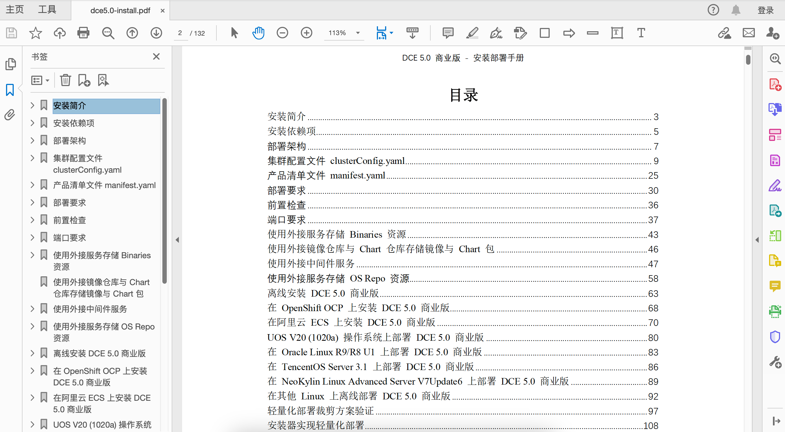

# DaoCloud Enterprise 5.0 下载导览页

DaoCloud Enterprise 5.0 有两个版本：社区版和商业版。

目前下载中心仅提供离线安装包。有关在线安装方式，请参阅[在线安装](../install/index.md)。

## 下载前置依赖包

| 最新离线包 | 版本 | 文件大小 | 下载 | 更新日期 |
| ------ | ---- | ---- | ---- |-------- |
| prerequisite_v0.31.0_amd64.tar.gz | v0.31.0 | 119.0 MB | [:arrow_down: 下载](https://qiniu-download-public.daocloud.io/DaoCloud_Enterprise/dce5/prerequisite_v0.31.0_amd64.tar.gz) | 2025-07-07 |
| prerequisite_v0.31.0_arm64.tar.gz | v0.31.0 | 107.0 MB | [:arrow_down: 下载](https://qiniu-download-public.daocloud.io/DaoCloud_Enterprise/dce5/prerequisite_v0.31.0_arm64.tar.gz) | 2025-07-07 |

## 下载社区版

此版本面向社区，欢迎免费体验。

| 最新离线包 | 版本 | 下载 | 更新日期 |
| -------- | ---- | --- | ------- |
| offline-community-v0.31.0-arm64.tar | v0.31.0 | [:arrow_right: 下载页](./free/dce5-installer-v0.31.0.md) | 2025-07-07 |
| offline-community-v0.31.0-amd64.tar | v0.31.0 | [:arrow_right: 下载页](./free/dce5-installer-v0.31.0.md) | 2025-07-07 |

[社区版：更多历史版本](./free/dce5-installer-history.md){ .md-button } 

## 下载商业版

此版本适合搭建私有云、混合云、多云、微服务等场景，可以定制丰富多样的云原生模块。

| 最新离线包 | 版本 | 下载 | 更新日期 |
| ----- | ----- | ---- | --------- |
| offline-v0.31.0-arm64.tar | v0.31.0 | [:arrow_right: 下载页](./business/dce5-installer-v0.31.0.md) | 2025-07-07 |
| offline-v0.31.0-amd64.tar | v0.31.0 | [:arrow_right: 下载页](./business/dce5-installer-v0.31.0.md) | 2025-07-07 |

[商业版：更多历史版本](./business/dce5-installer-history.md){ .md-button } 

## 下载 Addon 离线包

DCE 5.0 针对不同的应用场景提供了完善的 Addon，您可以按需下载使用。

| 最新离线包 | 版本 | 下载 | 更新日期 |
|--------| ---- | --- | --------- |
| metax-addon-offline-package-v0.31.0-amd64.tar.gz | v0.31.0 | [:arrow_right: 下载页](./addon/v0.31.0.md) | 2025-07-10 |
| gpu-addon-offline-package-v0.31.0-arm64.tar.gz | v0.31.0 | [:arrow_right: 下载页](./addon/v0.31.0.md) | 2025-07-10 |
| gpu-addon-offline-package-v0.31.0-amd64.tar.gz | v0.31.0 | [:arrow_right: 下载页](./addon/v0.31.0.md) | 2025-07-10 |
| standard-addon-offline-package-v0.31.0-arm64.tar.gz | v0.31.0 | [:arrow_right: 下载页](./addon/v0.31.0.md) | 2025-07-10 |
| standard-addon-offline-package-v0.31.0-amd64.tar.gz | v0.31.0 | [:arrow_right: 下载页](./addon/v0.31.0.md) | 2025-07-10 |

[Addon：更多历史版本](./addon/history.md){ .md-button }

## 下载子模块

DCE 5.0 包含的众多子模块可以单独下载，按需对每个模块进行升级。

| 频道 | 模块 | 文件大小 | 下载 | 更新日期 |
| --- | ---- | ------ | ---- | ------ |
| 工作台 | 应用工作台 | 386.41 MB | [:arrow_right: 下载页](./modules/amamba.md) | 2025-07-20 |
| 容器 | 容器管理 | 756.22 MB | [:arrow_right: 下载页](./modules/kpanda.md) | 2025-07-17 |
| | 集群巡检 | 174.30 MB | [:arrow_right: 下载页](./modules/kcollie.md) | 2024-09-29 |
| | 应用备份 | 85.06 MB | [:arrow_right: 下载页](./modules/kcoral.md) | 2024-12-03 |
| | 安全管理 | 167.29 MB | [:arrow_right: 下载页](./modules/dowl.md) | 2023-11-26 |
| | 多云编排 | 663.57 MB | [:arrow_right: 下载页](./modules/kairship.md) | 2024-10-09 |
| | 镜像仓库 | 304.16 MB | [:arrow_right: 下载页](./modules/kangaroo.md) | 2024-10-11 |
| | 云原生网络 | 63.76 MB | [:arrow_right: 下载页](./modules/spidernet.md) | 2025-07-31 |
| | 云原生存储 | 1.62 GB | [:arrow_right: 下载页](./modules/hwameistor.md)| 2023-11-06 |
| | 虚拟机 | 1.43 GB | [:arrow_right: 下载页](./modules/virtnest.md) | 2025-07-01 |
| 微服务 | 可观测性 | 2.21 GB | [:arrow_right: 下载页](./modules/insight.md) | 2025-07-02 |
| | 仪表盘| 51 MB | [:arrow_right: 下载页](./modules/ipavo.md) | 2024-10-28 |
| | 微服务引擎| 1.66 GB | [:arrow_right: 下载页](./modules/skoala.md) | 2024-12-30 |
| | 服务网格 | 1.04 GB | [:arrow_right: 下载页](./modules/mspider.md) | 2025-08-01 |
| 中间件 | Elasticsearch |1.96 GB| [:arrow_right: 下载页](./modules/middleware/elasticsearch.md) |2025-05-13|
| | Kafka |1.07 GB| [:arrow_right: 下载页](./modules/middleware/kafka.md) |2025-05-13|
| | MinIO |181.39 MB| [:arrow_right: 下载页](./modules/middleware/minio.md) |2025-05-13|
| | MongoDB |383.70 MB| [:arrow_right: 下载页](./modules/middleware/mongodb.md) |2025-05-13|
| | MySQL |1.86 GB| [:arrow_right: 下载页](./modules/middleware/mysql.md) |2025-05-13|
| | PostgreSQL |1.28 GB| [:arrow_right: 下载页](./modules/middleware/postgresql.md) |2025-05-13|
| | RabbitMQ |306.52 MB| [:arrow_right: 下载页](./modules/middleware/rabbitmq.md) |2025-05-13|
| | Redis |732.78 MB| [:arrow_right: 下载页](./modules/middleware/redis.md) |2025-05-13|
| | RocketMQ |697.28 MB| [:arrow_right: 下载页](./modules/middleware/rocketmq.md) |2025-05-13|
| 边缘计算 | 云边协同 | 107 MB | [:arrow_right: 下载页](./modules/kant.md) | 2025-06-23 |
| 管理 | 全局管理 | 458.30 MB | [:arrow_right: 下载页](./modules/ghippo.md) | 2025-07-09 |
| | 运营管理 | 96.41 MB | [:arrow_right: 下载页](./modules/gmagpie.md) | 2025-07-01 |
| | 设备管理 | 47.89 MB | [:arrow_right: 下载页](./modules/topohub.md) | 2025-06-27 |

!!! note

    - 升级子模块之后，可能需要重新灌入 License 并激活。
    - DaoCloud Enterprise 5.0 还处于发布初期，将陆续增加各个子模块的离线包。
    - 若有任何疑问，请[提出反馈](https://github.com/DaoCloud/DaoCloud-docs/issues)。
    - 欢迎扫描二维码，与开发者畅快交流：

    

## 下载产品文档

本节提供 DCE 5.0 各个模块的离线文档 PDF 和 Docx 供查阅和下载。

| 模块 | 文件大小 | 下载 | 更新日期 | 备注 |
| --- | ---- | ---- | ------ | ---- |
| DCE 5.0 产品介绍 | 1.4 MB | [:arrow_down: 查阅并下载 PDF](https://harbor-test2.cn-sh2.ufileos.com/docs/download/docs/DCE5.0-intro.pdf) | 2025-01-21 | DCE 5.0 总体产品简介 |
| 商业版安装部署手册 | 5.8 MB | [:arrow_down: 查阅并下载 PDF](https://harbor-test2.cn-sh2.ufileos.com/docs/download/docs/dce5.0-install.pdf) | 2025-03-09 | 精修版 |
| 应用工作台 | 1.9 MB | [:arrow_down: 查阅并下载 PDF](https://harbor-test2.cn-sh2.ufileos.com/docs/download/docs/amamba.pdf) | 2025-03-10 | [mdctl](https://github.com/samzong/mdctl) 批量 md-docx 转换版 |
| 容器管理 | 24.9 MB | [:arrow_down: 查阅并下载 PDF](https://harbor-test2.cn-sh2.ufileos.com/docs/download/docs/kpanda.pdf) | 2025-03-10 | [mdctl](https://github.com/samzong/mdctl) 批量 md-docx 转换版 |
| 多云编排 | 3.1 MB | [:arrow_down: 查阅并下载 PDF](https://harbor-test2.cn-sh2.ufileos.com/docs/download/docs/kairship.pdf) | 2025-03-10 | [mdctl](https://github.com/samzong/mdctl) 批量 md-docx 转换版 |
| 镜像仓库 | 2.4 MB | [:arrow_down: 查阅并下载 PDF](https://harbor-test2.cn-sh2.ufileos.com/docs/download/docs/kangaroo.pdf) | 2025-03-10 | [mdctl](https://github.com/samzong/mdctl) 批量 md-docx 转换版 |
| 云原生网络 | 12.7 MB | [:arrow_down: 查阅并下载 PDF](https://harbor-test2.cn-sh2.ufileos.com/docs/download/docs/network.pdf) | 2025-03-10 | [mdctl](https://github.com/samzong/mdctl) 批量 md-docx 转换版 |
| 云原生存储 | 2.7 MB | [:arrow_down: 查阅并下载 PDF](https://harbor-test2.cn-sh2.ufileos.com/docs/download/docs/storage.pdf) | 2025-03-10 | [mdctl](https://github.com/samzong/mdctl) 批量 md-docx 转换版 |
| 虚拟机 | 5.3 MB | [:arrow_down: 查阅并下载 PDF](https://harbor-test2.cn-sh2.ufileos.com/docs/download/docs/virtnest.pdf) | 2025-03-10 | [mdctl](https://github.com/samzong/mdctl) 批量 md-docx 转换版 |
| 可观测性 | 798 KB | [:arrow_down: 查阅并下载 PDF](https://harbor-test2.cn-sh2.ufileos.com/docs/download/docs/insight.pdf) | 2025-03-10 | [mdctl](https://github.com/samzong/mdctl) 批量 md-docx 转换版 |
| 微服务引擎 | 9.4 MB | [:arrow_down: 查阅并下载 PDF](https://harbor-test2.cn-sh2.ufileos.com/docs/download/docs/skoala.pdf) | 2025-03-10 | [mdctl](https://github.com/samzong/mdctl) 批量 md-docx 转换版 |
| 服务网格 | 3.7 MB | [:arrow_down: 查阅并下载 PDF](https://harbor-test2.cn-sh2.ufileos.com/docs/download/docs/mspider.pdf) | 2025-03-10 | [mdctl](https://github.com/samzong/mdctl) 批量 md-docx 转换版 |
| 中间件 | 14.8 MB | [:arrow_down: 查阅并下载 PDF](https://harbor-test2.cn-sh2.ufileos.com/docs/download/docs/mcamel.pdf) | 2025-03-10 | [mdctl](https://github.com/samzong/mdctl) 批量 md-docx 转换版 |
| AI Lab | 10.3 MB | [:arrow_down: 查阅并下载 PDF](https://harbor-test2.cn-sh2.ufileos.com/docs/download/docs/AI-lab.pdf) | 2024-12-31 | 精修版 |
| 云边协同 | 3.8 MB | [:arrow_down: 查阅并下载 PDF](https://harbor-test2.cn-sh2.ufileos.com/docs/download/docs/kant.pdf) | 2025-03-10 | [mdctl](https://github.com/samzong/mdctl) 批量 md-docx 转换版 |
| 全局管理 | 5.7 MB | [:arrow_down: 查阅并下载 PDF](https://harbor-test2.cn-sh2.ufileos.com/docs/download/docs/ghippo.pdf) | 2025-03-10 | [mdctl](https://github.com/samzong/mdctl) 批量 md-docx 转换版 |
| **以上所有模块的 Docx 压缩包** | 125.04 MB | [:arrow_down: 下载 Docx 压缩包](https://harbor-test2.cn-sh2.ufileos.com/docs/download/docs/docx.zip) | 2025-03-10 | 以上 PDF 对应的所有 Docx 文件 |
| **以上所有模块的 PDF 压缩包** | 77.46 MB | [:arrow_down: 下载 PDF 压缩包](https://harbor-test2.cn-sh2.ufileos.com/docs/download/docs/pdf.zip) | 2025-03-10 | 以上 PDF 的集合 |

!!! tip

    - 有关批量生成 Docx 和 PDF，请参阅 [mdctl 批量生成操作步骤](https://docs.daocloud.io/native/git/md-docx)
    - 查阅 PDF 时，可借助 **书签** 和 **目录** 快速浏览并导航到对应章节

    

[安装 DCE 5.0](../install/index.md){ .md-button .md-button--primary }
[申请社区免费体验](../dce/license0.md){ .md-button .md-button--primary }
